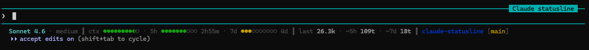

# claude-statusline

A Claude Code status bar showing model, context/rate-limit usage, turn stats, and current location.



```
Sonnet 4.6 · medium  ┃  ctx ●●●●●●●●●○ · 5h ●●●●●●○○○○ 1h5m · 7d ●●●●●○○○○○ 3d  ┃  last 34.2k · ~5h 120t · ~7d 172t  ┃  claude-statusline [main]
```

Four zones (separated by `┃`):
1. **Model** — display name and effort level
2. **Metrics** — 10-dot bars for context window, 5-hour limit, and 7-day limit remaining; time-to-reset after each limit bar. Each bar has 5% resolution: `●` = 10%, `◐` = 5%, `○` = 0%
3. **Turn stats** — last turn token count, estimated turns remaining within each rate-limit window
4. **Location** — current directory name, git branch in brackets

Colors reflect **remaining** capacity: green >50%, yellow 20–50%, red ≤20%. A reverse-video red `▐ ⚠ 5H LIMIT CRITICAL ▌` badge appears when the 5-hour limit drops to ≤5% remaining.

## Install

**Dependencies:** bash, grep, sed, git, date, python3 — no other tools required.

```sh
bash install.sh
```

Then restart Claude Code.

<details>
<summary>Manual install</summary>

1. Copy the script to `~/.claude/`:

   ```sh
   cp statusline-command.sh ~/.claude/statusline-command.sh
   ```

2. Add the `statusLine` block to `~/.claude/settings.json` (merge with any existing content):

   ```json
   {
     "statusLine": {
       "type": "command",
       "command": "bash ~/.claude/statusline-command.sh"
     }
   }
   ```

   The full snippet is in `settings-snippet.json`.

3. Restart Claude Code.

</details>

## Notes

- The script reads from the JSON Claude pipes to the statusline command on each update — no polling, no background process.
- Turn estimates (`~5h Xt`, `~7d Xt`) are approximations based on the current session's JSONL transcript. Cross-session turns in the same rate-limit window are not visible, so estimates skew optimistically.
- If your home directory is not `/home/<you>` (e.g. macOS `/Users/<you>`), the `~` in the settings command handles it automatically.
